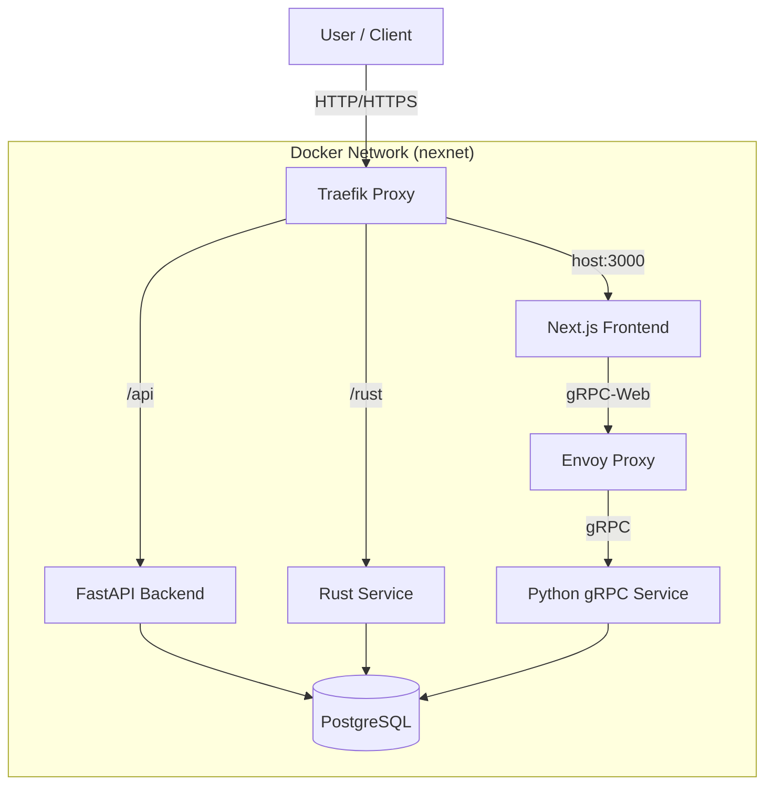

# Architecture

NexPyRS follows a microservices architecture orchestrated by Docker Compose.

## Services

| Service | Technology | Port (Internal) | Description |
| :--- | :--- | :--- | :--- |
| **Frontend** | Next.js (React) | 3000 | The main user interface. |
| **API** | FastAPI (Python) | 8000 | REST API for general business logic. |
| **RustSvc** | Actix-web (Rust) | 8001 | High-performance compute tasks. |
| **GrpcSvc** | gRPC (Python) | 50051 | Microservice for real-time/streaming. |
| **Database** | PostgreSQL | 5432 | Primary data store. |
